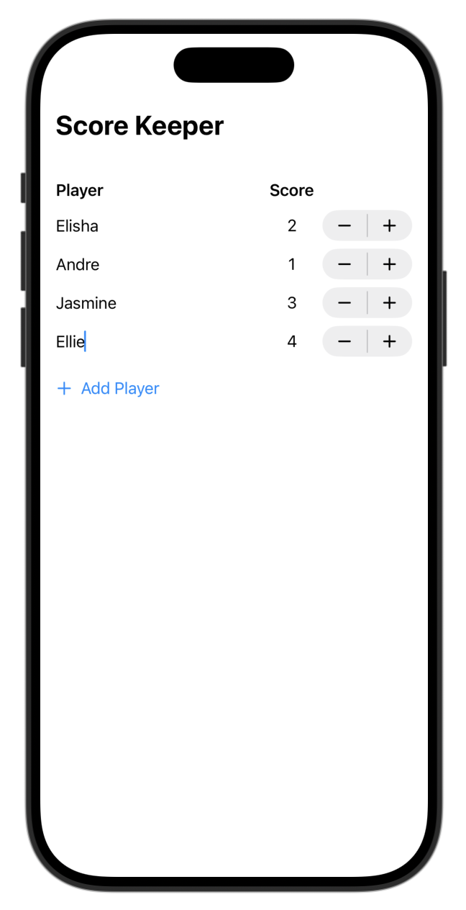

## Data Modeling _ [ch.1-1 Model data with custom types](https://developer.apple.com/tutorials/develop-in-swift/model-data-with-custom-types)

- custom struct type 정의
```swift
import Foundation

struct Player: Identifiable {
    let id = UUID()
    var name: String
    var score: Int
}

// 프로토콜(Protocal) : 객체가 특정 기능을 수행하기 위해 갖춰야 하는 최소한의 요구사항을 정의
// Identifiable 프로토콜 : 고유한 정체성 부여를 위해 id 속성이 필요
// UUID(Universally Unique Identifier) : 전역 고유 식별자로 중복되지 않음
```


- Grid / GridRow
```swift
Grid {
    GridRow {
        ...
    }
    ForEach($players) { $player in
        GridRow {
            ...
        }
    }
}

// Grid, GridRow를 활용하여 표 구조의 레이아웃 표현 가능
// Grid는 전체 표를, GridRow는 각 행을 나타내며, 각 행에 포함되는 요소의 길이나 개수가 달라도 자동으로 표 구조의 레이아웃이 갖춰짐
```


## Preview


