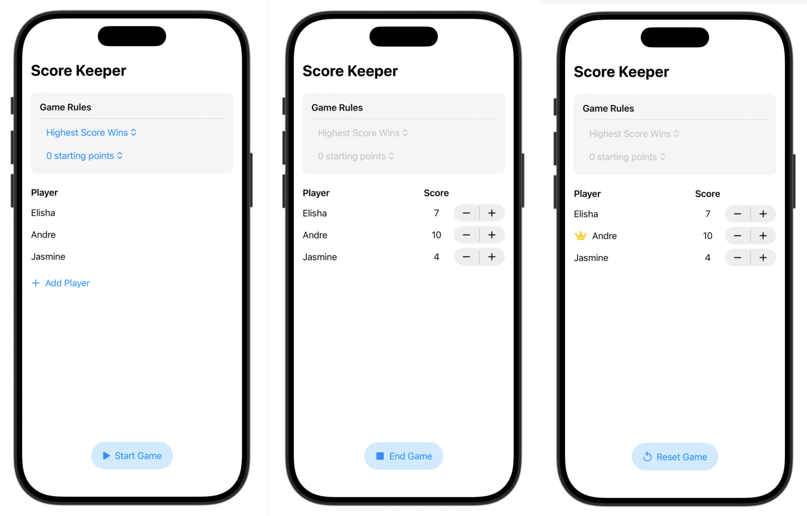

## Data Modeling _ [ch.1-2 Add functionality with Swift Testing](https://developer.apple.com/tutorials/develop-in-swift/add-functionality-with-swift-testing)

- enumerations
```
import Foundation

// 열거형 타입을 이용해 상태와 같이 서로 관련 있지만 상호 배타적인 유형에 대해 정의
enum GameState {
    case setup
    case playing
    case gameOver
}

//enum을 활용한 switch문
switch scoreboard.state {
case .setup:
    ...
    
case .playing:
    ...
    
case .gameOver:
    ...
    
// 모든 case를 정의하지 않을 경우, default: 사용
}
```


- mutating func
```
// struct의 methods가 struct의 properties 값을 수정하는 경우, mutating 키워드를 이용해 표시 필요
struct Scoreboard {
    ...
    mutating func resetScores(to newValue: Int) {
        ...
    }
}
```


- Testing
```
import Testing
// @testable을 이용해 테스트하고자하는 앱(ScoreKeeper)을 import해야 test 환경에서 앱의 내부 메서드에 대한 접근이 가능
@testable import ScoreKeeper

struct ScoreKeeperTests {
    //Test 제목
    @Test("Reset player scores", arguments: [0, 10, 20])
    func resetScores(to newValue: Int) async throws {
        // Test 내용
        var scoreboard = Scoreboard(players: [
            Player(name: "Elisha", score: 0),
            Player(name: "Andre", score: 5),
        ])
        scoreboard.resetScores(to: newValue)

        // Test 기대 결과 검증
        for player in scoreboard.players {
            #expect(player.score == newValue)
        }
    }


}
```


- Picker
```
//Picker에서 선택된 옵션의 tag 값이 selection에 binding된 변수의 값으로 반영됨
Picker("Starting points", selection: $startingPoints) {
    Text("Option 0")
        .tag(0)
    Text("Option 10")
        .tag(10)
    ...
}
```


- struct의 동등성 판단을 위한 Equatable 확장
```
struct Player: Identifiable {
    ...
}

// 사용자가 정의한 타입의 동등성 비교를 위해서는 동등성 판단의 기준이 필요
extension Player: Equatable {
    static func == (lhs: Player, rhs: Player) -> Bool {
        lhs.name == rhs.name && lhs.score == rhs.score
    } // 두 Player의 name, score가 같을 때 두 Player가 동등하다고 판단
}
```


## Preview


