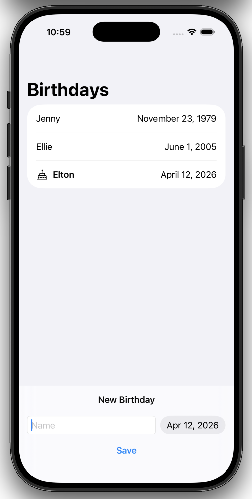

## Data Modeling _ [ch.2 Save data Testing](https://developer.apple.com/tutorials/develop-in-swift/save-data)

- .safeAreaInset
```swift
List(friends, id: \.name) { friend in
    // 현 예제에서는 List에 붙여서 사용되었으나, ScrollView, VStack, ZStack 등 다양한 view에 붙여서 사용할 수 있음
    ...
}
.safeAreaInset(edge: .bottom) {
    // edge 방향을 지정하여 해당 방향에 고정된 콘텐츠 영역을 만듦
    ...
}
```


- DatePicker
```swift
DatePicker(selection: $newDate, in: Date.distantPast...Date.now, displayedComponents: .date) {
    TextField("Name", text: $newName)
        .textFieldStyle(.roundedBorder)
}

// selection: 값을 저장할 변수 binding
// in: 선택 가능한 날짜의 범위 (Date.distantPast...Date.now -> 과거~현재만 선택 가능)
// displayedComponents: 표시할 date 범위 (년/월/일, 시/분 등)
// {...}: DatePicker에 대한 레이블(TextField 사용 시, 이름을 동시에 입력받음)
```


- SwiftData model
```swift
import Foundation
import SwiftData

// @Model annotation 명시 및 class 사용
@Model
class Friend {
    var name: String
    var birthday: Date

    // struct와 달리, class는 자동 생성되는 생성자가 없으므로 직접 정의해야 함
    init(name: String, birthday: Date) {
        self.name = name
        self.birthday = birthday
    }
}
```
```swift
// BirthdaysApp.swift

import SwiftUI
import SwiftData

@main
struct BirthdaysApp: App {
    var body: some Scene {
        WindowGroup {
            ContentView()
                .modelContainer(for: Friend.self)
                // .modelContainer modifier를 이용해 SwiftUI와 SwiftData를 연결
        }
    }
}
```
```swift
// ContentView.swift

struct ContentView: View {
    @Query(sort: \Friend.birthday) private var friends: [Friend]
    @Environment(\.modelContext) private var context
    
    var body: some View {
        ...
        Button("Save") {
            let newFriend = Friend(name: newName, birthday: newDate)
            // SwiftData를 사용할 경우, list.append(newFriend) -> context.insert(newFriend)
            context.insert(newFriend)
            
            newName = ""
            newDate = .now
        }
    }
}
```


## Preview


